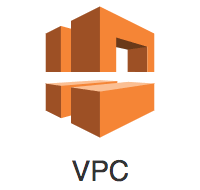
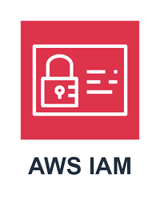
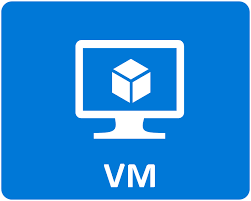
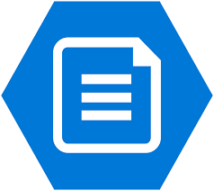

# FYI: Coming soon! or On the works

# ☁️ Cloud Portfolio

This section highlights my beginner‑level hands‑on experience with cloud fundamentals, including virtual machines, networking, identity, storage, and basic automation in AWS and Azure. These projects reflect the foundational cloud skills I’m building through labs and guided practice.

---

## 🔧 Core Cloud Skills

- Creating and managing virtual machines (AWS EC2, Azure VMs)
- Basic cloud networking (VPCs, subnets, security groups, NSGs)
- Identity & access basics (IAM roles, users, policies)
- Storage fundamentals (S3, Azure Storage accounts)
- Cloud CLI usage (AWS CLI, Azure CLI)
- Basic monitoring and logging
- Understanding shared responsibility and cloud security basics

---

## 🗂️ Projects

### 1. AWS VPC & EC2 Lab

**Summary:**  
Built a simple AWS environment to understand how cloud networking and virtual machines work. Focused on VPC structure, subnets, routing, and launching EC2 instances.

**Key Work:**  
- Created a VPC with public and private subnets
- Configured route tables and an Internet Gateway
- Launched EC2 instances and connected via SSH
- Set up Security Groups for basic access control
- Practiced starting, stopping, and resizing instances

**Documentation:**  
- [`aws-vpc-ec2-lab`](aws-vpc-ec2-lab.md)

---

### 2. AWS IAM & Access Management Basics

**Summary:**  
Explored AWS IAM to understand how cloud permissions and identity work. Created users, groups, and simple policies to control access.

**Key Work:**  
- Created IAM users and groups
- Attached beginner‑level IAM policies
- Practiced least‑privilege concepts
- Configured MFA for account security
- Used AWS CLI with IAM credentials

**Documentation:**  
- [`aws-iam-basics`](aws-iam-basics.md)  

---

### 3. Azure Virtual Machine & Networking Lab 

**Summary:**  
Deployed a Windows or Linux VM in Azure to learn how compute, networking, and identity integrate in the Azure ecosystem.

**Key Work:**  
- Created a resource group and virtual network
- Deployed an Azure VM and connected via RDP/SSH 
- Configured Network Security Groups (NSGs)  
- Attached and managed OS disks
- Practiced VM resizing and monitoring

**Documentation:**  
- [`azure-vm-lab`](azure-vm-lab.md)

---

### 4. 4. Azure Storage & File Services

**Summary:**  
Set up Azure Storage accounts to understand cloud storage types, access methods, and basic security controls.

**Key Work:**  
- Created a storage account
- Configured containers and uploaded files
- Practiced access keys and SAS tokens  
- Explored redundancy options (LRS, GRS)
- Connected storage to a VM for testing

**Documentation:**  
- [`azure-storage-lab`](azure-storage-lab.md)

---

### 5. Cloud Monitoring & Logging Basics

**Summary:**  
Used AWS CloudWatch and Azure Monitor to understand how cloud resources are monitored and how logs/metrics are collected.

**Key Work:**  
- Viewed CPU, disk, and network metrics
- Configured basic alerts
- Explored log groups and log analytics
- Tested alert triggers using VM stress tools
- Documented findings and dashboards

**Documentation:**  
- [`cloud-monitoring-basics`](cloud-monitoring-basics.md)

---