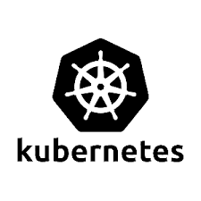
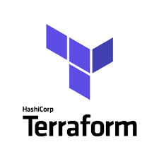
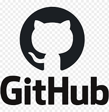

# FYI: Coming soon! or On the works

# 🚀 DevSecOps / Automation Portfolio

This section highlights my hands‑on learning and practical lab work in automation, secure configuration management, containerization, CI/CD, and infrastructure as code. These projects reflect my growing experience with DevSecOps tools and workflows.

---

## 🧰 Core DevSecOps Skills

- Basic Ansible automation (playbooks, simple roles)
- Docker containerization (building images, running containers)
- Kubernetes fundamentals (deployments, services, namespaces)
- Terraform basics (provisioning simple AWS resources)
- Introductory CI/CD pipelines (GitHub Actions)
- YAML, Git, version control
- Security‑focused configuration and scanning in lab environments

---

## 🗂️ Projects

### 1. Secure Linux Configuration with Ansible

**Summary:**  
Created beginner‑level Ansible playbooks to automate Linux configuration tasks and apply basic security settings in a lab environment.

**Key Work:**  
- Installed packages and managed services
- Configured SSH settings and user accounts
- Applied simple hardening tasks
- Organized playbooks and inventory files
- Tested changes on local VMs

**Documentation:**  
- [`Secure Ansible Baseline`](Secure_Ansible_Baseline.md)
- [`RHEL Automation Notes`](RHEL_Automation_Notes.md)

---

### 2. Dockerized Web Application Deployment

**Summary:**  
Containerized a small web application using Docker to learn image creation, container management, and multi‑container setups.

**Key Work:**  
- Built Dockerfile and custom images
- Ran containers locally
- Used docker‑compose for multi‑service apps
- Practiced environment variable handling
- Explored basic container security concepts

**Documentation:**  
- [`Docker Build & Run`](Docker_Build.md)
- [`Docker Notes`](Docker_Notes.md)

---

### 3. Kubernetes Lab Deployment (Minikube / k3s)

**Summary:**  
Set up a Kubernetes lab environment to learn how applications are deployed and managed in a cluster.

**Key Work:**  
- Created simple Deployments and Services
- Organized workloads using namespaces
- Practiced rolling updates and scaling
- Exposed applications using NodePort
- Explored basic pod security settings

**Documentation:**  
- [`Kubernetes Lab Setup`](Kubernetes_Lab.md)
- [`k8s-deployment-notes`](Notes.md)

---

### 4. Terraform AWS Infrastructure Provisioning

**Summary:**  
Used Terraform to provision basic AWS resources in a sandbox environment to understand infrastructure‑as‑code concepts.

**Key Work:**  
- Created VPC, subnets, and an EC2 instance
- Used variables and outputs
- Practiced terraform init/plan/apply/destroy
- Organized files into a simple module structure
- Learned how IAM roles apply to infrastructure

**Documentation:**  
- [`Terraform AWS Lab`](Terraform_AWS_Lab.md)

---

### 5. CI/CD Pipeline with GitHub Actions

**Summary:**  
Built a beginner‑level CI/CD pipeline to automate building and testing a containerized application.

**Key Work:**  
- Created workflow YAML files
- Automated Docker image builds
- Added basic linting steps
- Used GitHub Secrets for environment variables
- Practiced branch‑based workflows

**Documentation:**  
- [`Github Actions Pipeline`](github-actions-pipeline.md)

---