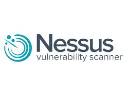
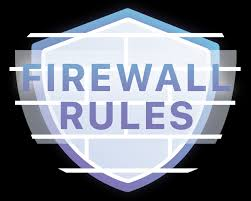

# FYI: Coming soon! or On the works

# 🔐 Infrastructure Security Portfolio

This section highlights my beginner‑level hands‑on experience with system hardening, basic vulnerability scanning, access control, logging, and foundational security practices. These projects reflect the security concepts I’m actively learning and applying across Linux, Windows, and cloud environments.

---

## 🔧 Core Cloud Skills

- Basic system hardening (SSH, permissions, services)
- Intro vulnerability scanning (Nessus)
- Identity & access fundamentals (IAM, AD permissions)
- Simple firewall rules and segmentation
- Certificate basics (self‑signed certs, key pairs)
- Log review and basic monitoring
- Understanding of least privilege and shared responsibility

---

## 🗂️ Projects

### 1. Linux System Hardening Basics

**Summary:**  
Applied beginner‑friendly hardening steps to Linux servers to reduce exposure and improve baseline security.

**Key Work:**  
- Set up SSH key authentication
- Disabled password login and restricted root access
- Adjusted file permissions and removed unused services
- Applied simple CIS/STIG‑inspired settings
- Reviewed authentication logs for failed login attempts

**Documentation:**  
- [`linux-hardening`](linux-hardening.md)
- [`secure-ssh-baseline`](secure-ssh-baseline.md)

---

### 2. Vulnerability Scanning

**Summary:**  
Used Nessus in a lab environment to learn how vulnerability scanning works and how to interpret basic findings.

**Key Work:**  
- Ran basic authenticated scans
- Identified outdated packages and insecure configs
- Applied patches and simple configuration fixes
- Re‑scanned systems to confirm remediation
- Documented common vulnerabilities and resolutions

**Documentation:**  
- [`vulnerability-scan-lab`](vulnerability-scan-lab.md)  

---

### 3. Basic Firewall Rules & Segmentation

**Summary:**  
Configured simple firewall rules to control traffic between systems and practice network segmentation concepts.

**Key Work:**  
- Created allow/deny rules based on ports
- Configured simple NAT and port forwarding
- Tested rules using ping, curl, and port scans  
- Used packet capture tools to verify rule behavior
- Documented rule logic and traffic flow

**Documentation:**  
- [`firewall-basics-lab`](firewall-basics-lab.md)

---

### 4. Certificate Basics & Secure Access

**Summary:**  
Learned how certificates work by generating keys, creating self‑signed certificates, and using them for secure access.

**Key Work:**  
- Generated key pairs and CSRs
- Created self‑signed certificates
- Configured SSH and simple web services to use certificates
- Tested certificate expiration and renewal

**Documentation:**  
- [`certificate-authentication-lab`](certificate-authentication-lab.md)

---

### 5. Logging & Monitoring Fundamentals

**Summary:**  
Configured basic logging and monitoring to understand how systems record events and how logs support troubleshooting and security.

**Key Work:**  
- Forwarded Linux logs to a Syslog server
- Reviewed authentication and service logs
- Used Windows Event Viewer for system and security events
- Created simple alerts for failed login attempts
- Documented log sources and retention basics

**Documentation:**  
- [`logging-monitoring-basics`](logging-monitoring-basics.md)

---