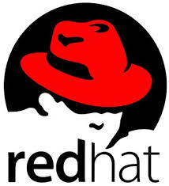
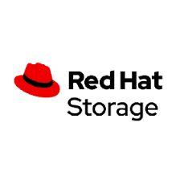
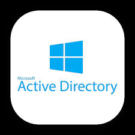
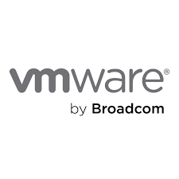

# FYI: Coming soon! or On the works

# 🖥️ Linux and Systems Administration Portfolio

This section highlights my hands‑on experience administering Linux and Windows Server environments, managing virtualization platforms, automating routine tasks, and maintaining secure, stable systems. These projects reflect real‑world responsibilities I’ve handled across system configuration, storage management, identity services, and troubleshooting.

---

## 🔧 Core Systems Skills

- Linux administration (users, permissions, services, SSH, systemd)
- Windows Server (AD DS, DNS, DHCP, Group Policy)
- Virtualization (VMware, Hyper‑V, VirtualBox)
- Bash & PowerShell scripting for automation
- System hardening, patching, and baseline configuration
- Monitoring & troubleshooting (logs, performance tools)
- Networking fundamentals for system operations (DNS, ports, firewalls)

---

## 🗂️ Projects

### 1. Linux Server Administration  

**Summary:**  
Built, configured, and hardened RHEL servers following industry best practices. Performed day‑to‑day Linux administration tasks across authentication, services, storage, and system monitoring.

**Key Work:**  
- Applied system hardening (SSH configs, permissions, service lockdown)
- Managed filesystems, LVM, and disk utilization monitoring 
- Configured automated patching and update workflows
- Created monitoring scripts for CPU, RAM, and disk  

**Documentation:**  
- [`linux-hardening`](linux-hardening.md)
- [`ansible-automation`](ansible-automation.md)

---

### 2. Linux Storage, Filesystems & LVM Administration  

**Summary:**  
Designed and managed Linux storage using partitions, filesystems, and LVM. Performed live volume resizing, implemented monitoring, and automated cleanup tasks to maintain system stability.

**Key Work:**  
- Partitioned disks using `fdisk` and `parted`
- Created and managed LVM (PV → VG → LV)  
- Formatted and mounted filesystems (ext4, XFS)   
- Performed online filesystem expansion using `lvextend`, `resize2fs`, and `xfs_growfs` 
- Automated log cleanup and temporary file maintenance

**Documentation:**  
- [`lvm-provisioning`](lvm-provisioning.md)  
- [`disk-monitoring`](disk-monitoring.md)  

---

### 3. Windows Server Administration + Active Directory  

**Summary:**  
Deployed and administered Windows Server 2022 domain services, including Active Directory, DNS, DHCP, and Group Policy. Built a functional identity and access management environment for lab and testing scenarios.

**Key Work:**  
- Installed and configured AD DS  
- Set up DNS & DHCP  
- Created OU structure and Group Policies  
- Automated user provisioning with PowerShell
- Configured login scripts, mapped drives, and workstation policies

**Documentation:**  
- [`Domain Controller build`](adbuild.md)

---

### 4. Virtualization & Snapshots Lab  

**Summary:**  
Used VMware to practice virtualization fundamentals and support system administration tasks. Focused on provisioning VMs, managing snapshots, and understanding how virtualized environments support server operations.

**Key Work:**  
- Created and managed basic VMs in VMware
- Performed initial provisioning (CPU, RAM, disk, ISO mounting)
- Used snapshots before updates or configuration changes  
- Practiced expanding virtual disks and adjusting VM resources
- Managed VM power operations (start, stop, restart)
- Connected VMs to lab networks
- Troubleshot simple VM performance or connectivity issues

**Documentation:**  
- [`virtualization-notes.md`](virtualization-notes.md)

---

