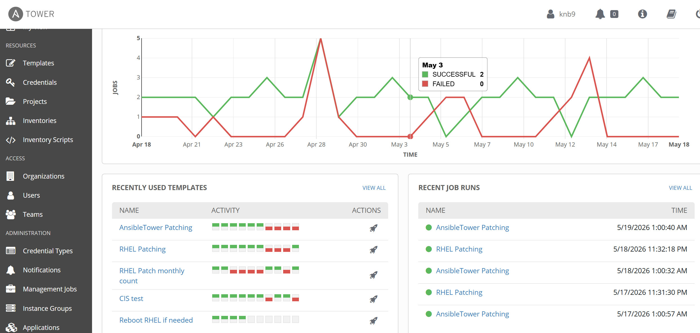
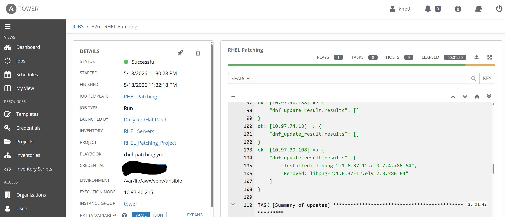
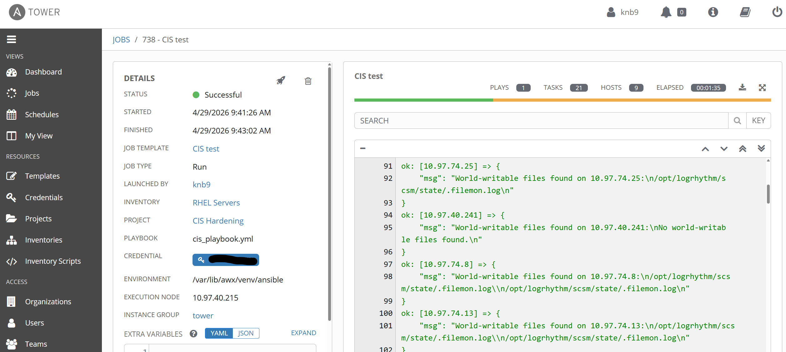

# 🧰 Ansible Automation for Linux Patching & CIS Hardening

This document outlines how I used **Ansible** to automate Linux patching and apply a targeted CIS hardening control. The goal was to ensure consistent, repeatable security maintenance across multiple servers with minimal manual effort.

---

## 🎯 Objectives

- Automate OS patching across multiple Linux servers  
- Apply a CIS‑aligned hardening control using Ansible  
- Reduce manual maintenance time  
- Ensure consistent configuration across environments  
- Build a foundation for future automation expansion  

---

## 🗂️ Repository Structure
```text
awx/
├── projects
    ├── RHEL_Patching_Project
    │   └── rhel_patching.yml
    │   └── ansibletower_patching.yml
    │   └── reboot_rhel_servers_when_needed.yml
    │   └── rhel_monthly_patchcount.yml
    │
    └── CIS_Hardening
        └── roles
            └── cis_security
                └── tasks
                    └── CIS-RedHat-8.yml
                    └── CIS-RedHat-9.yml
                    └── CIS_6.1_world_writable_permissions.yml
    
```

## 🔄 Automated Patching Playbook  
**Purpose:** Keep systems up‑to‑date with the latest security patches.

```yaml
# update-linux-servers.yml
# Author: Kurt Berglund
# Date: February 9, 2026
# Description: This playbook contains plays which are used to perform
#              software patching on ITOps-managed Linux virtual machines.
#

- name: Update Linux Servers
  hosts: all      # Run the plays in this playbook against every linux host in the inventory.
  become: true    # Ansible's become command allows us to elevate privileges when needed

  vars:
    #Exempt servers or IP's from doing patch and reboot
    exempt_ip:
      - "10.97.40.215"

  tasks:

    - name: Skip exempt servers
      ansible.builtin.meta: end_host
      when: ansible_default_ipv4.address in exempt_ip

    # ----------------------------------------------
    # SHOW AVAILABLE UPDATES
    # ---------------------------------------------
    - name: Check available updates (RHEL family)
      ansible.builtin.dnf:
        list: updates
      register: available_updates
      changed_when: false
      when: ansible_facts['os_family'] == "RedHat"

    - name: Show available updates
      ansible.builtin.debug:
        var: available_updates.results
      when: ansible_facts['os_family'] == "RedHat"

    # ---------------------------------------------
    # APPLY UPDATES
    # ---------------------------------------------
    - name: Apply Updates (RHEL family)
      ansible.builtin.dnf:
        name: "*"
        state: latest
        update_cache: true
      register: dnf_update_result
      when: ansible_facts['os_family'] == "RedHat"

    - name: Show what was updated
      ansible.builtin.debug:
        var: dnf_update_result.results
      when: ansible_facts['os_family'] == "RedHat"

    - name: Summary of updates
      ansible.builtin.debug:
        msg:
          - "Update Summary for {{ inventory_hostname }}"
          - "Packages updated: {{ dnf_update_result.results | length | default(0)}}"
          - "Updated packages:"
          - "{{ dnf_update_result.results | join(', ') | default('None') }}"
      when: ansible_facts['os_family'] == "RedHat"

    # ----------------------------------------------
    # REBOOT IF ANY UPDATES WERE INSTALLED
    # ----------------------------------------------
    - name: Reboot if updates were installed
      ansible.builtin.reboot:
        msg: "Rebooting {{ inventory_hostname }} because updates were installed"
        pre_reboot_delay: 3
        post_reboot_delay: 5
        reboot_timeout: 300
      when: dnf_update_result.changed

    - name: Wait for host after reboot
      ansible.builtin.wait_for_connection:
        delay: 5
        timeout: 300
      when: dnf_update_result.changed
```


##

**Purpose:** Find all world‑writable files on the system and removing using **chmod o-w**.
```yaml
# CIS_6.1_world_writable_permissions.yml
# Author: Kurt Berglund
# Date: February 2, 2026
# Description: This playbook implements a CIS Benchmark 6.1 control
#              that focuses on securing file system permissions.
#              Its purpose is to identify and remediate world‑writable
#              files, which are files that allow any user on the system 
#              to modify them.
#
# ============================================================
# CIS 6.1.10 — Ensure no world-writable files exist
# ============================================================
- name: Find world-writable files (CIS 6.1.10)
  shell: |
    find / /opt -xdev -type f -perm -0002 ! -type l 2>/dev/null
  register: ww_files
  changed_when: false
  tags:
    - cis_6_1_10

- name: Remove world-writable permissions (CIS 6.1.10)
  shell: chmod o-w "{{ item }}"
  loop: "{{ ww_files.stdout_lines }}"
  when: ww_files.stdout_lines | length > 0
  tags:
    - cis_6_1_10


# ============================================================
# CIS 6.1.11 — Ensure no unowned files or directories exist
# ============================================================
- name: Find unowned files and directories (CIS 6.1.11)
  shell: |
    find / -xdev -nouser 2>/dev/null
  register: unowned_files
  changed_when: false
  failed_when: false
  tags:
    - cis_6_1_11

- name: Fix unowned files and directories (CIS 6.1.11)
  shell: chown nccoeadmin "{{ item }}"
  loop: "{{ unowned_files.stdout_lines }}"
  when: unowned_files.stdout_lines | length > 0
  tags:
    - cis_6_1_11


# ============================================================
# CIS 6.1.12 — Ensure no ungrouped files or directories exist
# ============================================================
- name: Find ungrouped files and directories (CIS 6.1.12)
  shell: |
    find / -xdev -nogroup 2>/dev/null
  register: ungrouped_files
  changed_when: false
  failed_when: false
  tags:
    - cis_6_1_12

- name: Fix ungrouped files and directories (CIS 6.1.12)
  shell: chgrp nccoeadmin "{{ item }}"
  loop: "{{ ungrouped_files.stdout_lines }}"
  when: ungrouped_files.stdout_lines | length > 0
  tags:
    - cis_6_1_12


# ============================================================
# REPORTING — Summary and Per‑Host Output
# ============================================================

- name: Report world-writable files found on this host
  debug:
    msg: |
      World-writable files found on {{ inventory_hostname }}:
      
      {{ ww_files.stdout_lines | join('\n') }}
      
      No world-writable files found.
      
  tags:
    - cis_6_1_10
    - report

- name: Report unowned files found on this host
  debug:
    msg: |
      Unowned files on {{ inventory_hostname }}:
      
      {{ unowned_files.stdout_lines | join('\n') }}
      
      No unowned files found.
      
  tags:
    - cis_6_1_11
    - report

- name: Report ungrouped files found on this host
  debug:
    msg: |
      Ungrouped files on {{ inventory_hostname }}:
      
      {{ ungrouped_files.stdout_lines | join('\n') }}
      
      No ungrouped files found.
      
  tags:
    - cis_6_1_12
    - report

```

##
##  Screenshots

#

#

#